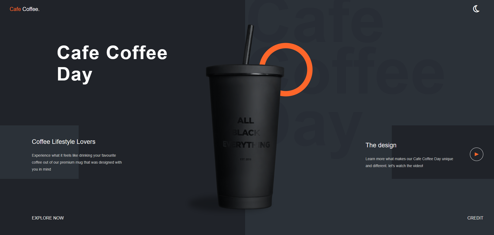
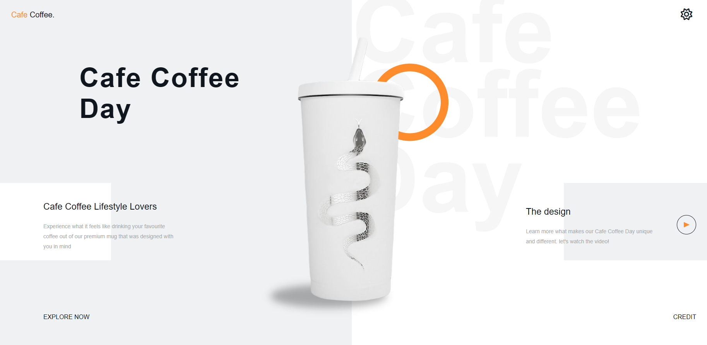

# Cafe Coffee Day Website

## Description
This project is a product showcase landing page for Cafe Coffee Day, tailored to delight coffee enthusiasts and loyal customers alike. It offers an immersive online experience designed to captivate individuals passionate about coffee and those dedicated to Cafe Coffee Day's brand. The website boasts a sleek and contemporary design, coupled with an intuitive user interface, all aimed at recreating the inviting ambiance of Cafe Coffee Day's physical locations in the digital realm.

## Dark & Light Theme Switch
Experience convenience with our dynamic dark & light theme switch, powered by JavaScript and CSS variables. Users have the flexibility to effortlessly toggle between dark and light themes, enhancing readability and providing a tailored browsing experience.

## Responsive Design
Enjoy a seamless and visually appealing experience across all screen sizes. Whether you're accessing the site from a desktop, tablet, or mobile device, our responsive design ensures consistency and elegance tailored to your device's specifications.

## Technologies Used
- HTML5
- CSS3
- JavaScript

## Dark Theme

## Light Theme

